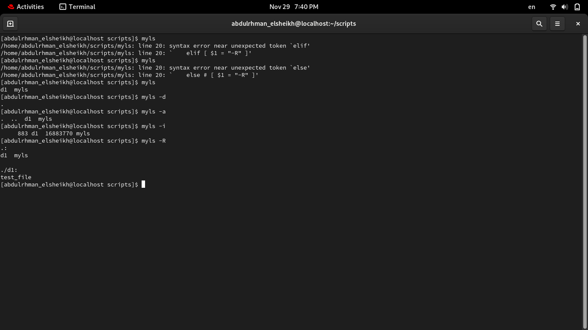

 1. # Lab 2
### 1. Create a script that asks for user name then send a greeting to him.

1) touch greetings  
2) vi greetings   
(type the following lines and save with esc then, :wq)  

```
#! /usr/bin/bash

echo "What's your name?"
read answer
echo "Hello, " $answer
```


3) sudo chmod u+x greeting  


### 2. Create a script called s1 that calls another script s2 where:
#### a. In s1 there is a variable called x, it's value 5
#### b. Try to print the value of x in s2 by two different ways.


```
#! /usr/bin/bash

#--------------------First Script (s1)---------------------------------

: '
The First Way
 x=5 '

# The second way
export x=5


#--------------------Second Script (s2)---------------------------------

. ./s1	       #equals  source ./s1
echo "x = " $x
```


### 3. Create a script called mycp where:
#### a. It copies a file to another
#### b. It copies multiple files to a directory.
```
#! /usr/bin/bash

PS3="Press 1 OR 2 =>  "

select opt in "copy file to another" "copy multiple files to a directory"
do
    case "$opt" in
        "copy file to another")
            read -p "Enter the source file: " source_file
            read -p "Enter the destination file: " destination_file
            cp "$source_file" "$destination_file"
            echo "File '$source_file' copied to '$destination_file'."
            ;;
            
        "copy multiple files to a directory")
            read -p "Enter the directory to copy to: " target_directory
            if [ ! -d "$target_directory" ]; then
	           mkdir $target_directory
            fi
            ls -a
            read -p "choose what files to copy (space-separated): " files_to_copy
            cp $files_to_copy "$target_directory"
            echo "Files copied to '$target_directory'."
            ;;
            
        *)
            echo "Invalid option. Please select 1 or 2."
            ;;
    esac
done

```

### 4. Create a script called mycd where:
#### a. It changed directory to the user home directory, if it is called without arguments.
#### b. Otherwise, it change directory to the given directory.

```
#! /usr/bin/bash

if [ $# == 0 ]; then
	cd ~
else
	cd $1
fi

```


### 5. Create a script called myls where:
#### a. It lists the current directory, if it is called without arguments.
#### b. Otherwise, it lists the given directory.

1) touch myls  
2) vi myls   
(type the following lines and save with esc then, :wq)  

```
#! /usr/bin/bash

if [ $# = 0 ] 
then
    ls
fi

```
NOTE: $# means number of arguments thisBashScriptTake as when calling to run

3) sudo chmod u+x myls 
4) append to $PATH variable  
> export PATH=$PATH:/home/user/scripts

5) finally run just with file name


### 6. Enhance the above script to support the following options individually:
#### a. –l: list in long format
#### b. –a: list all entries including the hiding files.
#### c. –d: if an argument is a directory, list only its name
#### d. –i: print inode number
#### e. –R: recursively list subdirectories

```
#! /usr/bin/bash

if [ $# = 0 ] 
then
    ls
elif [ $# = 1 ]
then
    if [ $1 = "-l" ]
    then
        ls -l  
    elif [ "$1" = "-a" ]
    then
        ls -a
    elif [ "$1" = "-d" ]
    then
        ls -d
    elif [ "$1" = "-i" ]
    then
        ls -i
    elif [ $1 = "-R" ]
    then
        ls -R
    fi    
elif [ $# = 2  ]
then
   ls $1 $2
fi
```



### 7. Create a script called mytest where:
#### a. It check the type of the given argument (file/directory)
#### b. It check the permissions of the given argument (read/write/execute)

```
#! /usr/bin/bash

<<comment
# This is 1st way
# echo $(file "$1") check every type of whatevery argument passed
---------------------------------------------------------
# This is 2nd way
# [ -f $1 ] && W="result = file" || W="result = other"
# echo "$W"
comment

if [ -f $1 ]
then
    echo "file"
elif [ -d $1 ]
then
    echo "directory"
fi

if [ -x $1 ]
then
    echo "It's executable"
elif [ -r $1 ]
then
    echo "It's readable"
elif [ -w $1 ] 
then
    echo "It's Writable"
fi
```


### 8. Create a script called myinfo where:
#### a. It asks the user about his/her logname.
#### b. It print full info about files and directories in his/her home directory
#### c. Copy his/her files and directories as much as you can in /tmp directory.
#### d. Gets his current processes status.

```
echo "what's your logname?"
read logname

home_dir=$(eval echo "~$logname")
ls -l /home/"$logname"

cp -r /home/"$logname" /home/newTmp

ps -u $logname
```